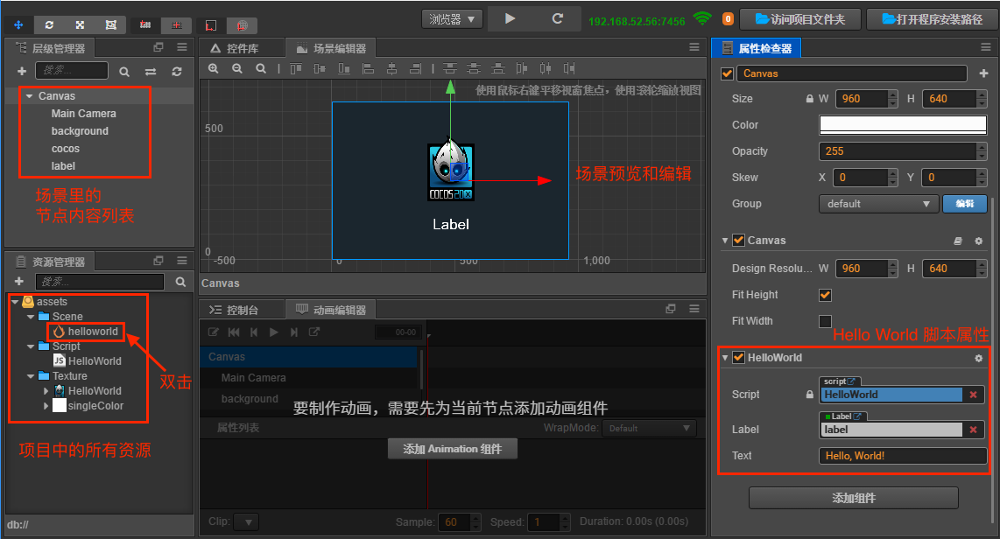
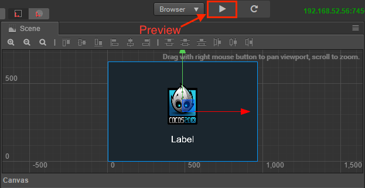
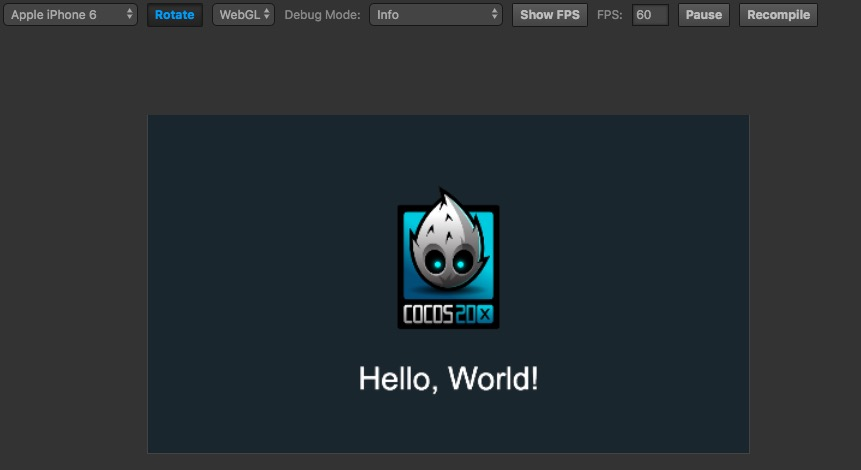
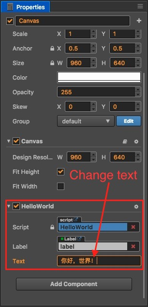
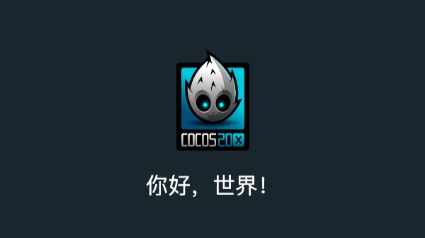

# cocos creator

## Cocos Creator

- 一个完整的游戏开发解决方案、跨平台游戏引擎、图形界面工具。
- 包含从设计、开发、预览、调试到发布的整个工作流所需的全功能一体化编辑器。
- 支持发布游戏到 **Web**、**iOS**、**Android**、各类"小游戏"、PC 客户端等平台。
- 脚本化、组件化、数据驱动。

#### 创建或导入资源
- 将图片、声音等资源拖拽到编辑器的资源管理器面板中，即可完成资源导入。
- 或者在编辑器中直接创建场景、预制、动画、脚本、粒子等各类资源。

#### 搭建场景
项目中有了一些基本资源后，就可以开始搭建**场景**了，**场景**是游戏内容最基本的组织方式，也是向玩家展示游戏的基本形态。

#### 添加组件脚本，实现交互功能
我们可以为场景中的节点挂载各种内置组件和自定义脚本组件，来实现游戏逻辑的运行和交互。包括从最基本的动画播放、按钮响应，到驱动整个游戏逻辑的主循环脚本和玩家角色的控制。几乎所有游戏逻辑功能都是通过挂载脚本到场景中的节点来实现的。

#### 一键预览和发布
搭建场景和开发功能的过程中，你可以随时点击预览来查看当前场景的运行效果。使用手机扫描二维码，可以立即在手机上预览游戏。当开发告一段落时，通过 构建发布 面板可以一键发布游戏到包括桌面、手机、Web 等多个平台。

## Dashboard（仪表盘）

- 启动 **Cocos Creator** ，并使用 **Cocos** 开发者帐号登录，打开 **Dashboard** 界面。

- 新建项目 选项卡里创建新的 Cocos Creator 项目。

- 在 **新建项目** 页面选择一个项目模板，项目模板会包括各种不同类型的游戏基本架构，以及学习用的范例资源和脚本。

> 注意：早期的 Cocos Creator 版本中还没有很多可选择的项目模板，我们会随着 Cocos Creator 功能逐渐完整持续添加更多模板为用户提供方便。

## Hello World

### 创建项目
在 **Dashboard** 中，打开 新建项目 选项卡，选中 Hello World 项目模板。

然后在下面的项目路径栏中指定一个新项目存放路径，路径的最后一部分就是项目文件夹名称。

填好路径后点击右下角的 **新建项目** 按钮，就会自动以 Hello World 项目模板创建项目并打开。

打开场景，开始工作
Cocos Creator 的工作流程是以数据驱动和场景为核心的，初次打开一个项目时，默认不会打开任何场景，要看到 Hello World 模板中的内容，我们需要先打开场景资源文件。

### open scene

在 资源管理器 中双击箭头所指的 helloworld 场景文件。Cocos Creator 中所有场景文件都以 **scene** 作为图标。

预览场景
要预览游戏场景，点击编辑器窗口正上方的 **预览游戏** 按钮。

### preview button

Cocos Creator 会使用您的默认浏览器运行当前游戏场景，效果如图所示：

### preview

点击预览窗口左上角的下拉菜单，可以选择不同设备屏幕的预览效果。

### 修改欢迎文字
`Cocos Creator 以数据驱动为核心的最初体现，就在于当我们需要改变 Hello World 的问候文字时，不需要再编辑脚本代码，而是直接修改场景中保存的文字属性。`

首先在 层级管理器 中选中 Canvas 节点，我们的 HelloWorld 组件脚本就挂在这个节点上。

接下来在 属性检查器 面板下方找到 HelloWorld 组件属性，然后将 Text 属性里的文本改成 ** 你好，世界！**：

### change text

再次运行预览，可以看到欢迎文字已经更新了：

